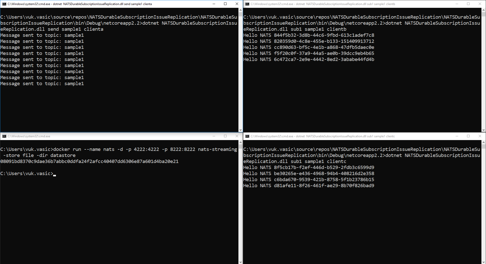
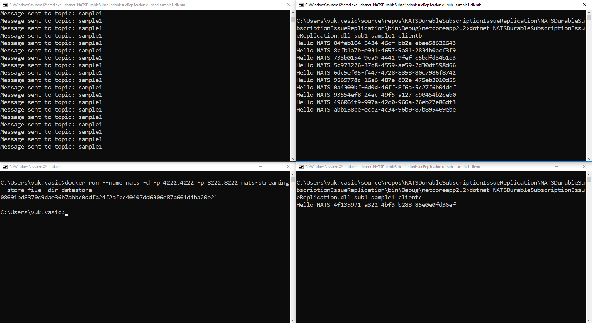

# Steps to reproduce the issue

First run NATS streaming. I used docker:
```
docker run -d -p 4222:4222 -p 8222:8222 nats-streaming -store file -dir datastore
```

1. Build project
2. Run 1 publisher with command
```
dotnet NATSDurableSubscriptionIssueReplication.dll send sample1 clienta
```
3. Run 2 consumers with next commands:

```
dotnet NATSDurableSubscriptionIssueReplication.dll sub1 sample1 clientb
```

```
dotnet NATSDurableSubscriptionIssueReplication.dll sub1 sample1 clientc
```

4. You will see that both consumer get message round-robin.

5. Kill consumers and leave producer sending message for a 10 seconds

6. Connect both consumers again.

7. Most of messages will be received by one consumer

